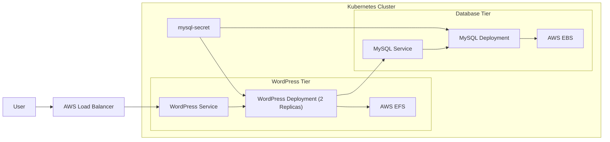
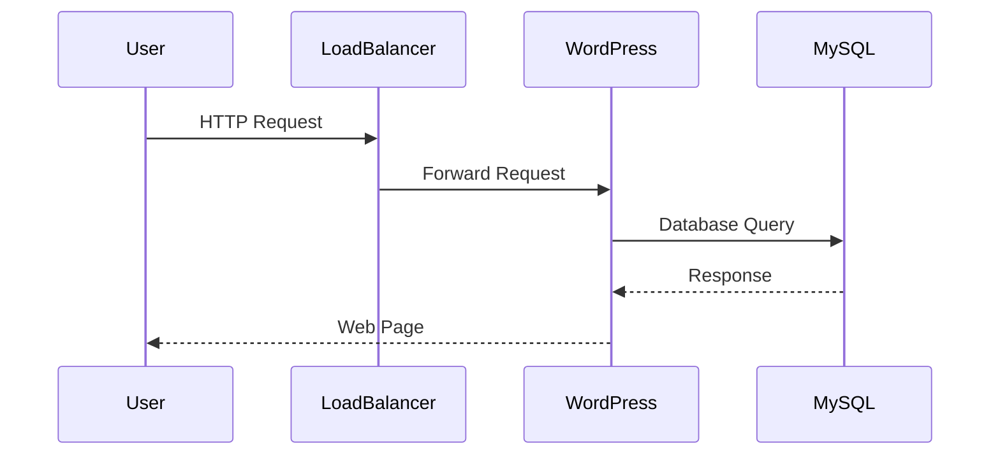

# KubePress

A highly available WordPress deployment on Kubernetes using AWS EFS for shared application storage and AWS EBS for MySQL persistent storage.

## Overview

KubePress is a two-tier cloud-native application deployed on Kubernetes.

The project consists of:

* WordPress application running with multiple replicas
* MySQL database running inside the cluster
* AWS EFS for shared WordPress storage
* AWS EBS for MySQL persistent storage
* Kubernetes Secrets for database credentials
* AWS Load Balancer for external access

## Architecture



## Repository Structure

```text
.
├── deploy-sc.yaml
├── deploy-pvc.yaml
├── deploy.yaml
├── lb-svc.yaml
├── mysql-sc.yaml
├── mysql-pvc.yaml
├── mysql-deploy.yaml
├── mysql-svc.yaml
└── README.md
```

## Components

### WordPress

* Deployment with 2 replicas
* Uses AWS EFS through a PersistentVolumeClaim
* Connects to MySQL through an internal Kubernetes Service
* Exposed externally using a LoadBalancer Service

### MySQL

* Deployment with 1 replica
* Uses AWS EBS through a PersistentVolumeClaim
* Exposed internally using a ClusterIP Service
* Stores WordPress application data

### Storage

#### WordPress Storage

| Component     | Value         |
| ------------- | ------------- |
| Storage Type  | AWS EFS       |
| Access Mode   | ReadWriteMany |
| Storage Class | sc-wp         |

#### MySQL Storage

| Component     | Value         |
| ------------- | ------------- |
| Storage Type  | AWS EBS       |
| Access Mode   | ReadWriteOnce |
| Storage Class | sc-mysql      |

## Persistent Storage Flow


## Deployment Workflow



## Prerequisites

* Kubernetes Cluster
* AWS EBS CSI Driver
* AWS EFS CSI Driver
* Existing AWS EFS File System
* kubectl
* AWS Load Balancer support

## Deployment

Create MySQL storage resources:

```bash
kubectl apply -f mysql-sc.yaml
kubectl apply -f mysql-pvc.yaml
```

Create WordPress storage resources:

```bash
kubectl apply -f deploy-sc.yaml
kubectl apply -f deploy-pvc.yaml
```

Create the MySQL Secret:

```bash
kubectl create secret generic mysql-secret \
  --from-literal=MYSQL_ROOT_PASSWORD=<root-password> \
  --from-literal=MYSQL_PASSWORD=<wordpress-password>
```

Deploy MySQL:

```bash
kubectl apply -f mysql-deploy.yaml
kubectl apply -f mysql-svc.yaml
```

Deploy WordPress:

```bash
kubectl apply -f deploy.yaml
kubectl apply -f lb-svc.yaml
```

Verify resources:

```bash
kubectl get pods
kubectl get svc
kubectl get pvc
```

## Security

Database credentials are stored in Kubernetes Secrets and injected into containers through environment variables.

Secrets used:

* MYSQL_ROOT_PASSWORD
* MYSQL_PASSWORD

## High Availability Features

* Multiple WordPress replicas
* Shared storage using AWS EFS
* Kubernetes self-healing
* Service-based load balancing
* Persistent storage for application and database data

## Technologies Used

* Kubernetes
* Docker
* WordPress
* MySQL 8.0
* AWS EFS
* AWS EBS
* AWS Load Balancer
* CSI Drivers
* Kubernetes Secrets
* Persistent Volumes
* Persistent Volume Claims
